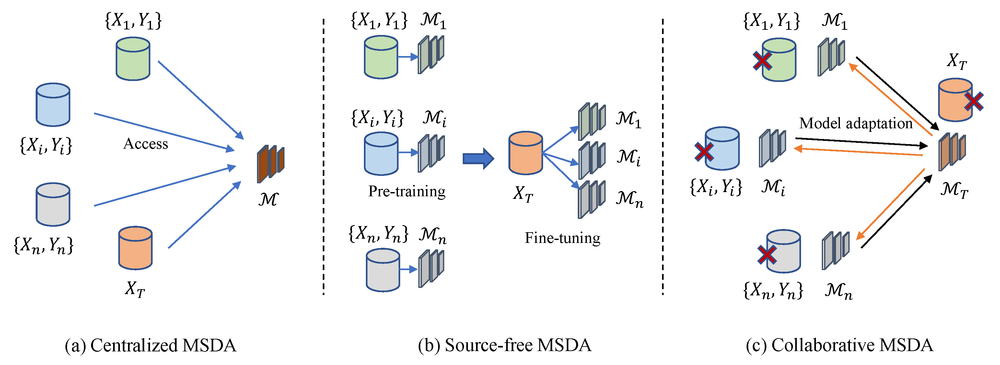
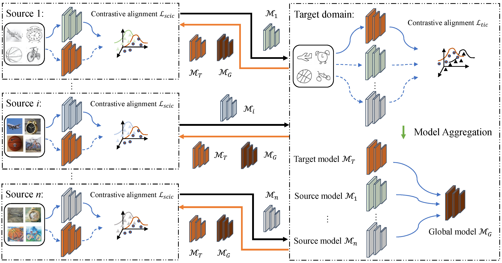
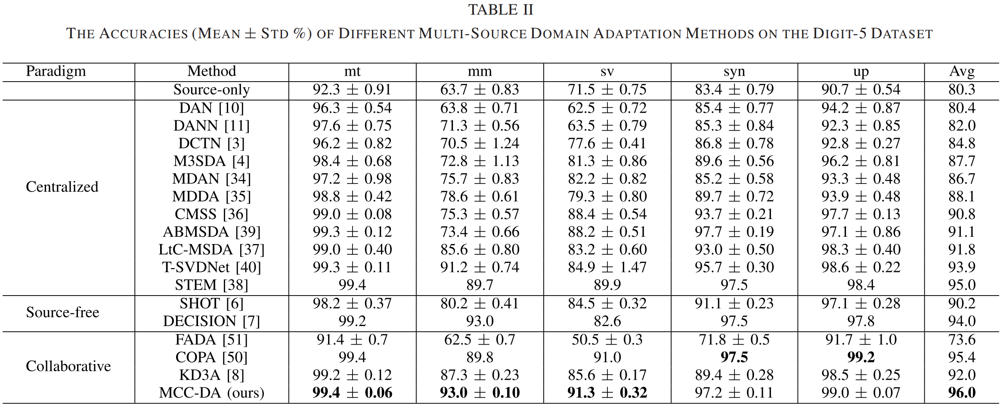
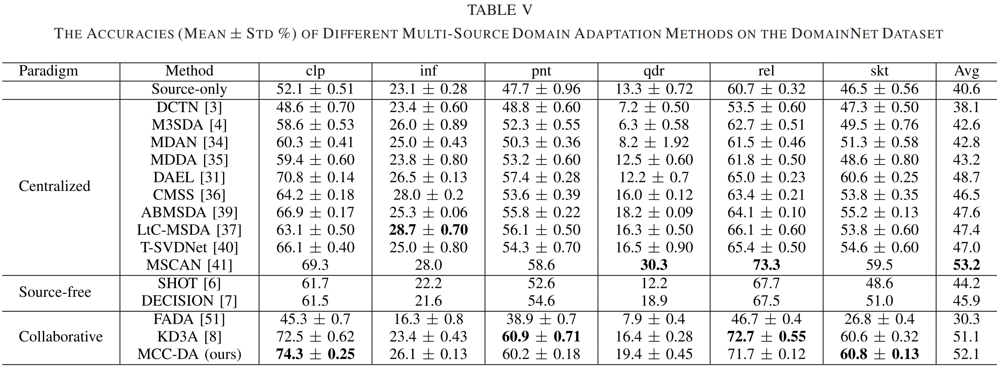

# Multi-source Collaborative Contrastive Learning for Decentralized Domain Adaptation
Here is the official implementation of the `MCC-DA` method in the paper `Multi-source Collaborative Contrastive Learning for Decentralized Domain Adaptation, IEEE TCSVT` [paper](https://ieeexplore.ieee.org/document/9940295).

## Abstract
Unsupervised multi-source domain adaptation aims to obtain a model working well on the unlabeled target domain by reducing the domain gap between the labeled source domains and the unlabeled target domain. Considering the data privacy and storage cost, data from multiple source domains and target domain are isolated and decentralized. This data decentralization scenario brings the difficulty of domain alignment for reducing the domain gap between the decentralized source domains and target domain, respectively. For conducting domain alignment under the data decentralization scenario, we propose Multi-source Collaborative Contrastive learning for decentralized Domain Adaptation (MCC-DA). The models from other domains are used as the bridge to reduce the domain gap. On the source domains and target domain, we penalize the inconsistency of data features extracted from the source domain models and target domain model by contrastive alignment. With the collaboration of source domain models and target domain model, the domain gap between decentralized source domains and target domain is reduced without accessing the data from other domains. The experiment results on multiple benchmarks indicate that our method can reduce the domain gap effectively and outperform the state-of-the-art methods significantly.

## Different setups of Multi-Source Domain Adaptation (MSDA)

  

* (a) MSDA under the data centralization scenario. The labeled source domain data and unlabeled target domain data can be accessed simultaneously for domain adaptation.
* (b) MSDA under the source-free paradigm. The source domain models are pre-trained on the labeled source domain data and then are fine-tuned on the unlabeled target domain.
* (c) MSDA under the collaborative paradigm. The labeled source domain data and unlabeled target domain data are isolated, the source domain models and target domain model are used as the bridges for model adaptation during training.

## Method

  

The contrastive alignment of MCC-DA on the decentralized source domains and target domain. On the source domains, the local source domain models are trained on their domain data with the collaboration of the local target domain model to conduct contrastive alignment. Then, the local source domain models are uploaded to the target domain. On the target domain, the local target domain model is trained on the target domain data with the collaboration of local source domain models to conduct contrastive alignment. Then, the local source domain models and the local target domain model are aggregated to obtain a global model by parameter averaging. The next round of collaborative adaptation is repeated by using the global model as the initial model for different domains.

## Setup
### Install Package Dependencies
```
Python Environment: >= 3.6
torch >= 1.2.0
torchvision >= 0.4.0
tensorbard >= 2.0.0
numpy
yaml
```
### Install Datasets
Please prepare the Digits-5, Office-Caltech10, Office31, and DomainNet dataset for MSDA task.
```
base_path
│       
└───dataset
│   │   DigitFive
│       │   ...
│   │   OfficeCaltech10
│       │   ...
│   │   Office31
│       │   ...
│   │   DomainNet
│       │   ...
```
<!-- Our framework now support four multi-source domain adaptation datasets: ```DigitFive, DomainNet, OfficeCaltech10 and Office31```. -->

<!-- * PACS

  The PACS dataset can be accessed in [Google Drive](https://drive.google.com/file/d/1QvC6mDVN25VArmTuSHqgd7Cf9CoiHvVt/view?usp=sharing). -->

### MCC-DA
The configuration files can be found under the folder  `./config`, and we provide four config files with the format `.yaml`. To perform the FedDA on the specific dataset (e.g., Digits-5), please use the following commands:

```python
nohup python main.py --config DigitFive.yaml --target-domain mnist -bp ../../../ --temperature 0.8 --smc 0.0 --tmc 0.0 --tic 1.0 --sic 0.01 --pl 3 --pj 0 --tau 0.05 --seed 1 --gpu 2  > ./log/digit5_tau005_tic1_scic001_mnist.txt 2>&1 &

nohup python main.py --config DigitFive.yaml --target-domain mnistm -bp ../../../ --temperature 0.8 --smc 0.0 --tmc 0.0 --tic 1.0 --sic 0.01 --pl 3 --pj 0 --tau 0.05 --seed 1 --gpu 1  > ./log/digit5_tau005_tic1_scic001_mnistm.txt 2>&1 &

nohup python main.py --config DigitFive.yaml --target-domain svhn -bp ../../../ --temperature 0.8 --smc 0.0 --tmc 0.0 --tic 1.0 --sic 0.01 --pl 3 --pj 0 --tau 0.05 --seed 1 --gpu 3  > ./log/digit5_tau005_tic1_scic001_svhn.txt 2>&1 &

nohup python main.py --config DigitFive.yaml --target-domain syn -bp ../../../ --temperature 0.8 --smc 0.0 --tmc 0.0 --tic 1.0 --sic 0.01 --pl 3 --pj 0 --tau 0.05 --seed 1 --gpu 4  > ./log/digit5_tau005_tic1_scic001_syn.txt 2>&1 &

nohup python main.py --config DigitFive.yaml --target-domain usps -bp ../../../ --temperature 0.8 --smc 0.0 --tmc 0.0 --tic 1.0 --sic 0.01 --pl 3 --pj 0 --tau 0.05 --seed 1 --gpu 5  > ./log/digit5_tau005_tic1_scic001_usps.txt 2>&1 &
```

The trained model on Digits-5 dataset can be downloaded in Baidu Yun:

Link: 

Code: 

The results on Digits-5 and DomainNet are as follows.

  

  

## Reference

If you find this useful in your work please consider citing:
```
@ARTICLE{mcc_da2022,
  author={Wei, Yikang and Yang, Liu and Han, Yahong and Hu, Qinghua},
  journal={IEEE Transactions on Circuits and Systems for Video Technology}, 
  title={Multi-Source Collaborative Contrastive Learning for Decentralized Domain Adaptation}, 
  year={2023},
  volume={33},
  number={5},
  pages={2202-2216},
  doi={10.1109/TCSVT.2022.3219893}}
```

And there are some federated multi-source domain adaptation methods and federated multi-source domain generalization proposed by us.
```
@article{Wei_Han_2024, 
  title={Multi-Source Collaborative Gradient Discrepancy Minimization for Federated Domain Generalization},
  journal={Proceedings of the AAAI Conference on Artificial Intelligence}, 
  author={Wei, Yikang and Han, Yahong}, 
  volume={38}, 
  number={14}, 
  year={2024}, 
  month={Mar.}, 
  pages={15805-15813},
  DOI={10.1609/aaai.v38i14.29510} 
}

@inproceedings{wei2023exploring,
  title={Exploring Instance Relation for Decentralized Multi-Source Domain Adaptation},
  author={Wei, Yikang and Han, Yahong},
  booktitle={ICASSP 2023-2023 IEEE International Conference on Acoustics, Speech and Signal Processing (ICASSP)},
  pages={1--5},
  year={2023},
  organization={IEEE}
}

@article{wei2022dual,
  title={Dual collaboration for decentralized multi-source domain adaptation},
  author={Wei, Yikang and Han, Yahong},
  journal={Frontiers of Information Technology \& Electronic Engineering},
  volume={23},
  number={12},
  pages={1780--1794},
  year={2022},
  publisher={Springer}
}
```

## Acknowledgments
The codes will be released once they are annotated.
